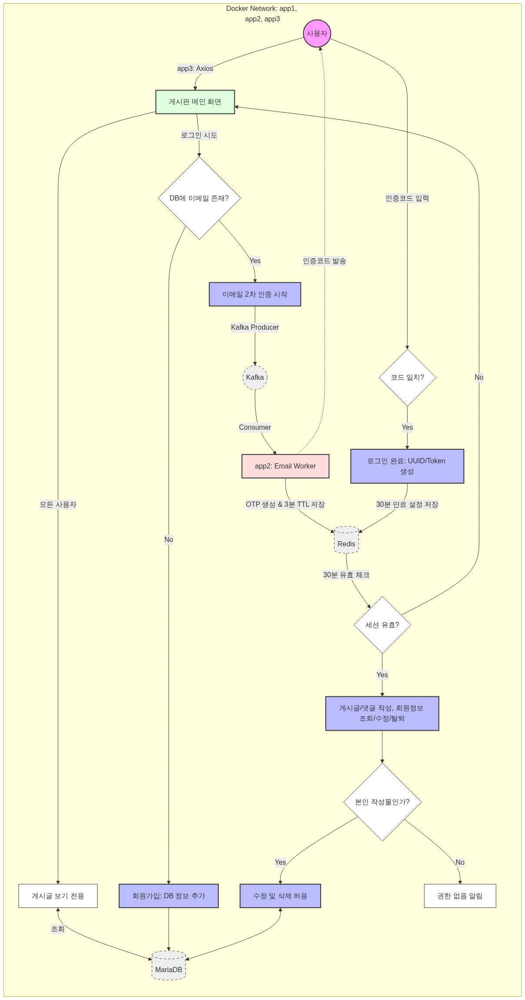
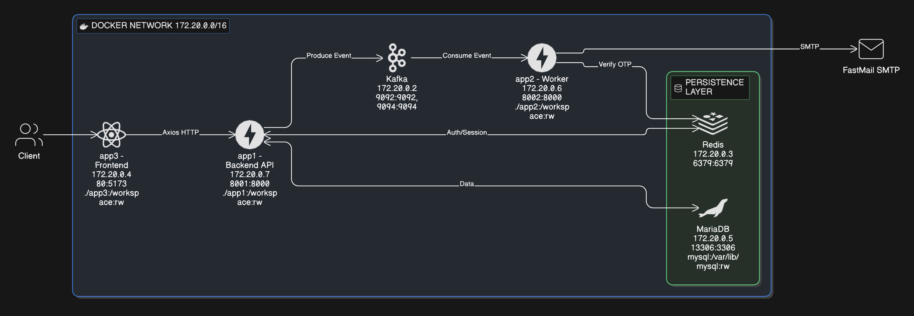

# 
```bash
02/12(목) 11:30 ~ 02/20(금) // 0212(목), 0213(금), 0219(목), 0220(금) 총 4일
http://quadecologics.cloud/
TEAM2 최윤우 김지환 최가영 최수아
```
```bash
📁 0220_miniTest_final/
├── 📁 app1/ (FastAPI - Producer)
│   ├── 📁 src/
│   │   ├── 📁 core/
│   │   │   ├── redis_client.py
│   │   │   ├── security.py
│   │   │   └── settings.py
│   │   ├── 📁 db/
│   │   │   ├── mariadb_crud.py
│   │   │   └── profile_upload.py
│   │   ├── models/
│   │   │   └── models.py
│   │   └── routes/
│   │       ├── auth.py
│   │       ├── board.py
│   │       └── user.py
│   ├── .python-version
│   ├── main.py
│   ├── pyproject.toml
│   ├── README.md
│   └── uv.lock
├── 📁 app2/ (FastAPI - Consumer)
│   ├── .python-version
│   ├── main.py
│   ├── pyproject.toml
│   ├── README.md
│   ├── settings.py
│   └── uv.lock
├── 📁 app3/ (React Frontend)
│   ├── 📁 public/
│   ├── 📁 src/
│   │   ├── assets/
│   │   └── main.jsx
│   ├── ui/
│   ├── eslint.config.js
│   ├── index.html
│   ├── package-lock.json
│   ├── package.json
│   ├── README.md
│   └── vite.config.js
├── 📁 mariadb/
│   ├── 📁conf.d/
│   │   └── my.cnf
│   └── 📁 initdb.d/
│       └── ddl.sql
├── .gitignore
├── compose.yml (Docker Orchestration)
├── dockerfile
└── README.md
```



